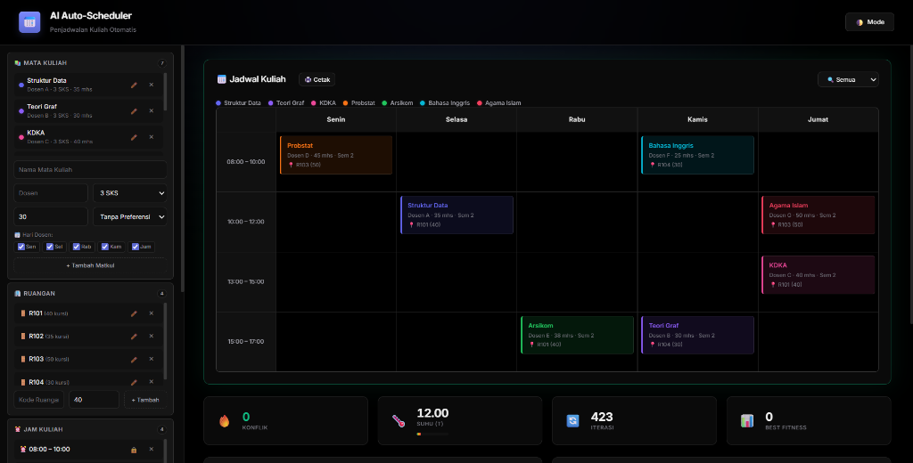

# AI Auto-Scheduler 📅

Aplikasi penjadwalan kuliah otomatis cerdas berbasis web murni. Dibangun untuk mempermudah penyusunan jadwal kuliah bebas bentrok dengan menerapkan algoritma Kecerdasan Buatan (AI) — **Graph Coloring** + **Simulated Annealing**.

> **100% Client-Side** — Tidak memerlukan server, database, atau framework apapun. Cukup buka `index.html` di browser.

---

## 🚀 Fitur Utama

### 🤖 Algoritma AI
- **Greedy Graph Coloring** — Membangun solusi awal (heuristik *Largest Degree First*).
- **Simulated Annealing** — Optimasi global yang mampu keluar dari *local optima* dengan probabilitas penerimaan solusi lebih buruk yang menurun seiring waktu.
- **Progress Bar Real-Time** — Menampilkan persentase iterasi SA secara visual selama proses generate.

### 🔒 Hard Constraints (Aturan Ketat)
- **Kelas Paralel (Multi-Room)** — Beberapa kelas dapat dijadwalkan secara paralel di satu slot waktu yang sama, asalkan ditempatkan di **ruangan yang berbeda**.
- **Kapasitas Ruangan** — AI tidak akan menaruh 45 mahasiswa di ruangan berkapasitas 30.
- **Ketersediaan Dosen Berbasis Jam (Time-Blocking)** — Setiap mata kuliah bisa diatur ketersediaan dosennya secara **spesifik per hari DAN per jam** (misalnya: *"Senin 08:00-10:00"* saja, bukan sekadar *"hari Senin penuh"*). AI akan menghindari slot waktu yang tidak tersedia. Mendukung backward compatibility dengan format lama (hari saja).
- **Kelas & Semester Sama** — Mata kuliah di semester yang sama (dan bukan kelas paralel seperti Kelas A vs Kelas B) otomatis tidak boleh dijadwalkan bersamaan. AI pintar membedakan kelas paralel dari nama matkul.
- **Dosen Sama** — Mata kuliah dengan dosen yang sama otomatis tidak boleh bentrok di waktu yang sama.

### 🎯 Soft Constraints (Preferensi)
- **Hindari Pagi / Sore** — Preferensi waktu per mata kuliah (penalti ringan jika dilanggar).

### 🖱️ Interaksi & UX
- **Drag & Drop (Desktop + Mobile)** — Geser kartu jadwal secara manual ke slot lain.
- **Validasi Real-Time Drag** — Saat mulai drag, cell valid berwarna **hijau**, cell invalid berwarna **merah**. Tidak perlu menebak-nebak.
- **Tooltip Interaktif** — Hover pada kartu jadwal → popup detail: Dosen, SKS, Mahasiswa, Ruangan, Kapasitas, Ketersediaan, Status Konflik.
- **Filter Tampilan Jadwal** — Filter kalender berdasarkan **Dosen**, **Ruangan**, atau **Semester**. Kartu yang tidak cocok otomatis meredup.
- **Inline Edit** — Edit nama/dosen/kapasitas langsung di sidebar tanpa perlu hapus & buat ulang.
- **Lock Timeslot** — Kunci jam tertentu sebagai waktu istirahat (tidak akan dipakai AI).
- **Undo/Redo** — Batalkan atau ulangi perubahan jadwal (drag, generate, load versi) dengan tombol atau `Ctrl+Z`/`Ctrl+Y`.
- **Pencarian Cepat** — Search box di sidebar untuk menemukan matkul, dosen, atau ruangan secara instan.
- **Onboarding Tutorial** — Panduan interaktif 4 langkah untuk pengguna baru (muncul otomatis pertama kali).
- **Keyboard Shortcuts** — `Ctrl+Z` Undo, `Ctrl+Y` Redo, `Ctrl+S` Simpan Versi, `Ctrl+G` Generate, `Ctrl+E` Export Excel.

### ⏰ Modal Ketersediaan Dosen (Time-Blocking)
- **Grid Interaktif Hari × Jam** — Saat menambahkan mata kuliah, klik tombol *"Atur Waktu"* untuk membuka modal popup berisi matriks checkbox (Hari vs Jam).
- **Presisi Tinggi** — Atur ketersediaan dosen hingga ke level slot jam spesifik (misalnya: hanya Senin 08:00 & 10:00, Selasa 08:00).
- **Tombol Praktis** — Tombol *"Pilih Semua"* untuk dosen yang selalu tersedia.
- **Backward Compatible** — Data lama dengan format hari saja (`[0,1,2,3,4]`) tetap terbaca tanpa error.

### 📐 Multi-SKS (Multi-Slot)
- **Matkul 4 SKS = 2 Slot Berurutan** — AI otomatis menempatkan matkul 4 SKS di 2 jam berturutan (misalnya 08-10 + 10-12) dengan ruangan yang sama. Badge "2 Slot" tampil di kartu.

### 📊 Dashboard Statistik
- **Donut Chart** — Utilisasi ruangan (berapa slot terpakai dari total).
- **Bar Chart** — Beban dosen (jumlah matkul per dosen).
- **Bar Chart** — Distribusi matkul per hari (Senin-Jumat). Ditampilkan otomatis setelah generate.

### 💾 Data Management
- **Auto-Save** — Semua data otomatis tersimpan di `localStorage`. Refresh halaman? Data tetap ada.
- **Import CSV** — Impor data mata kuliah dari file CSV (mendukung 2 format: hasil export & CSV generik).
- **Manajemen Versi** — Simpan jadwal sebagai "Versi" bernama, muat kembali kapan saja, atau hapus.

### 📤 Export Multi-Format
| Format | Tombol | Deskripsi |
|---|---|---|
| **CSV** | 💾 CSV | File `.csv` siap buka di Excel/Sheets |
| **PNG** | 📸 PNG | Screenshot kalender resolusi tinggi (2x) |
| **Excel** | 📊 Excel | File `.xlsx` dengan kolom terformat rapi |
| **PDF** | 📄 PDF | Dokumen A4 landscape dengan tabel berwarna |
| **Print** | 🖨️ Cetak | Print-view bersih (latar putih, tanpa sidebar) |

### 👤 Cetak Jadwal Personal (Per Dosen / Per Kelas)
- **Filter Cerdas** — Pilih **Per Dosen** (misal: "Dosen A") atau **Per Kelas** (misal: "Kelas B") untuk mengekspor jadwal yang hanya berisi data entitas tersebut.
- **Preview Sebelum Ekspor** — Tabel preview ditampilkan langsung di dalam modal sebelum Anda mengunduh file.
- **Multi-Format** — Ekspor jadwal personal ke **PDF**, **Excel**, atau **CSV**. File otomatis dinamai sesuai filter (contoh: `jadwal_Dosen_A.pdf`, `jadwal_Kelas_B.xlsx`).
- **Sangat Praktis** — Langsung bagikan file jadwal spesifik ke dosen atau grup kelas tanpa perlu memotong dari jadwal induk.

### 🎨 Tampilan
- **Dark Mode & Light Mode** — Toggle tema dengan satu klik. Notifikasi, tooltip, dan graf otomatis menyesuaikan.
- **Desain Premium** — Terinspirasi Vercel & Linear: hitam sejati, tipografi Inter, aksen indigo, glassmorphism, mikro-animasi.
- **Visualisasi Graf Konflik** — Canvas interaktif menggambar node (matkul) dan edge (konflik) dengan warna jadwal.

---

## 🛠️ Teknologi yang Digunakan

| Teknologi | Kegunaan |
|---|---|
| **HTML5** | Struktur semantik, Canvas API |
| **CSS3** | Flexbox, Grid, Custom Properties, Animasi, `@media print` |
| **Vanilla JavaScript (ES6+)** | Seluruh logika — zero framework, zero build step |
| **html2canvas** | Export ke PNG |
| **SheetJS (xlsx)** | Export ke Excel `.xlsx` |
| **jsPDF + AutoTable** | Export ke PDF dengan tabel otomatis |

---

## 📂 Struktur Proyek

```
AI scheduler/
├── index.html      # Kerangka UI + CDN scripts + 2 Modal (Availability & Personal Export)
├── style.css       # Styling, tema, animasi, responsive, modal, print
├── app.js          # Kontrol UI, DOM, drag-drop, filter, tooltip, export, personal export, version mgmt
├── data.js         # Preset data, konstanta hari/waktu/warna, constraint builder, isLecturerAvailable()
├── graph.js        # Kelas ConflictGraph (adjacency list + edge reasons)
├── solver.js       # AI engine: Greedy Coloring, Fitness, SA, validateDrop()
└── README.md       # Dokumentasi ini
```

### Deskripsi File

- **`index.html`** — Kerangka utama. Sidebar (4 panel: Matkul, Ruangan, Jam, Versi) + Main (Kalender, Stats, Log, Graf). 2 Modal popup (Ketersediaan Dosen & Personal Export). Memuat 5 CDN library.
- **`style.css`** — 27 section CSS: reset, layout, sidebar, forms, buttons, calendar, stats, log, notifications, animations, responsive, tooltip, filter, drag validation, version, availability, progress bar, modal & availability grid, print.
- **`app.js`** — ~2500 baris. Mengelola state, event handlers, rendering, drag & drop (mouse + touch), tooltip hover, filter kalender, version management, export (CSV/PNG/Excel/PDF), import CSV, modal ketersediaan dosen (time-blocking), dan personal export (per dosen/kelas).
- **`data.js`** — Konstanta `DAYS`, `TIME_SLOTS`, `COURSE_COLORS` (12 warna), `PRESET_ROOMS` (4 ruangan + kapasitas), `PRESET_COURSES` (7 matkul + ketersediaan dosen time-blocked). Fungsi `isLecturerAvailable()` (backward-compatible), `generateAllSlots()`, dan `buildConstraints()`.
- **`graph.js`** — Kelas `ConflictGraph` dengan adjacency list dan edge reasons. Factory method `fromConstraints()`.
- **`solver.js`** — `greedyColoring()` (solusi awal), `calculateFitness()` (hard + soft penalty), `getNeighborState()`, `simulatedAnnealing()` (async, dengan callback UI), `validateDrop()` (validasi drag real-time). Semua fungsi menggunakan helper `isLecturerAvailable()` untuk pengecekan ketersediaan.

---

## 💡 Cara Penggunaan

### Mulai Cepat
1. Buka `index.html` di browser modern (Chrome, Edge, Firefox, Safari) atau gunakan *Live Server* VSCode.
2. Klik **📋 Load Preset** untuk mengisi data contoh (7 matkul, 4 ruangan).
3. Klik **⚡ Generate Jadwal** — AI akan bekerja dan menampilkan progress bar.
4. Selesai! Lihat jadwal di kalender, hover untuk detail, drag untuk modifikasi.

### Fitur Lanjutan
- **Tambah Manual** — Isi form di sidebar, klik *"Atur Waktu"* untuk mengatur ketersediaan dosen per jam.
- **Lock Jam Istirahat** — Klik 🔒 pada jam kuliah → jam tersebut dilewati AI.
- **Simpan Versi** — Ketik nama di panel "Versi Jadwal" → klik 💾 Simpan.
- **Filter** — Pilih filter di atas kalender (Dosen/Ruangan/Semester) → yang lain meredup.
- **Import CSV** — Klik 📂 Import CSV → pilih file `.csv` → data otomatis ditambahkan.
- **Export** — Pilih format: CSV, PNG, Excel, atau PDF.
- **Cetak Personal** — Klik **👤 Cetak Jadwal Personal** → pilih Dosen/Kelas → preview → ekspor ke PDF/Excel/CSV.

### Format CSV untuk Import

**Format 1 — Hasil export dari app ini:**
```csv
Hari,Waktu,Mata Kuliah,Dosen,SKS,Jumlah Mahasiswa,Ruangan,Kapasitas
Senin,08:00 – 10:00,Struktur Data,Dosen A,3,35,R101,40
```

**Format 2 — CSV generik:**
```csv
Nama,Dosen,SKS,Jumlah Mahasiswa
Struktur Data,Dosen A,3,35
```

---

## 🧠 Algoritma

### Alur Kerja
```
Input (Matkul, Ruangan, Jam)
        ↓
Build Conflict Graph (Dosen sama / Semester sama)
        ↓
Greedy Graph Coloring (Largest Degree First)
        ↓
Simulated Annealing (T₀=100, cooling=0.995, max 5000 iterasi)
        ↓
Output: Jadwal optimal (target: 0 konflik)
```

### Fitness Function
| Jenis | Penalti | Deskripsi |
|---|---|---|
| Hard | +10 | Matkul menumpuk di **waktu yang sama** dan **ruangan yang sama** |
| Hard | +10 | Matkul yang memiliki konflik dosen/kelas dijadwalkan bersamaan |
| Hard | +10 | Mahasiswa > kapasitas ruangan |
| Hard | +10 | Dosen dijadwalkan di **hari dan jam** yang tidak tersedia |
| Soft | +2 | Preferensi waktu dilanggar |

### Simulated Annealing
- **Solusi lebih baik (ΔE < 0)** → Langsung diterima
- **Solusi sama (ΔE = 0)** → Diterima 50%
- **Solusi lebih buruk (ΔE > 0)** → Diterima dengan probabilitas `e^(-ΔE/T)` — menurun seiring suhu turun
- **Early termination** jika penalti = 0

---

## 📸 Screenshot


*(Note: Pastikan file `media__1780737767803.png` atau `screenshot.png` berada di folder yang sama)*
*Tampilan utama: Sidebar input, kalender jadwal dengan warna matkul, statistik AI, dan graf konflik.*

---

*Dikembangkan sebagai proyek praktikum AI — mendemonstrasikan Graph Coloring dan Simulated Annealing untuk masalah penjadwalan universitas.*
